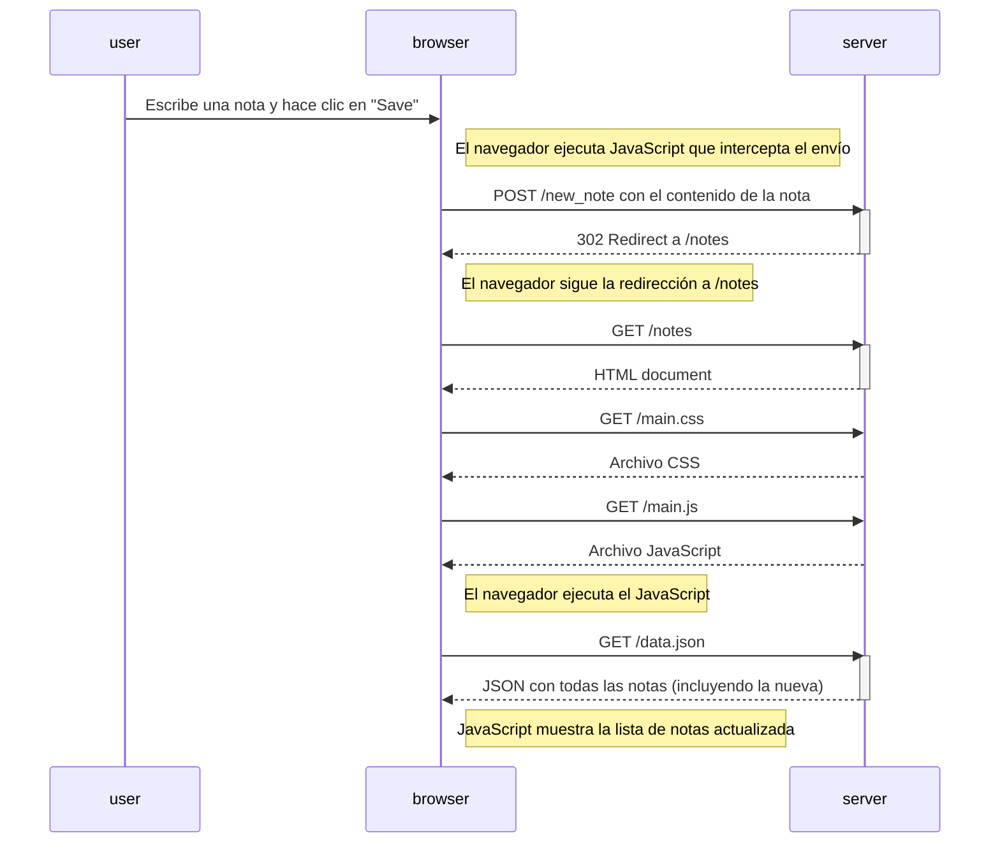

```mermaid
sequenceDiagram
    participant user
    participant browser
    participant server

    user->>browser: Escribe una nota y hace clic en "Save"
    Note right of browser: El navegador ejecuta JavaScript que intercepta el envío

    browser->>server: POST /new_note con el contenido de la nota
    activate server
    server-->>browser: 302 Redirect a /notes
    deactivate server

    Note right of browser: El navegador sigue la redirección a /notes

    browser->>server: GET /notes
    activate server
    server-->>browser: HTML document
    deactivate server

    browser->>server: GET /main.css
    server-->>browser: Archivo CSS

    browser->>server: GET /main.js
    server-->>browser: Archivo JavaScript

    Note right of browser: El navegador ejecuta el JavaScript

    browser->>server: GET /data.json
    activate server
    server-->>browser: JSON con todas las notas (incluyendo la nueva)
    deactivate server

    Note right of browser: JavaScript muestra la lista de notas actualizada
```
